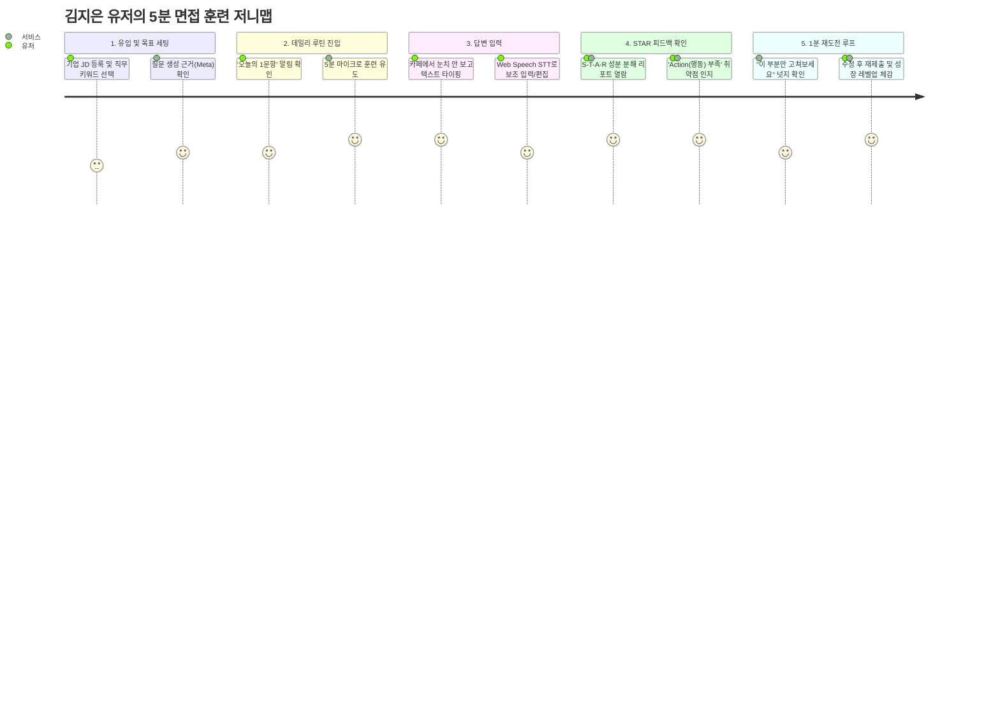

# AI Interview

## 1. 프로젝트 개요

### 프로젝트명
- 미정

### 한 줄 정의
- 기업/JD 기반 질문과 STAR 기반 설명 가능한 피드백으로 사용자의 면접 역량 성장과 반복 학습 습관을 만드는 AI 피드백 플랫폼

### 핵심 목표
- 면접 결과를 단순 평가가 아니라 “성장 가능한 행동 피드백”으로 전환한다.
- 사용자가 “무엇이 부족한지”와 “어떻게 개선할지”를 명확히 체감하도록 한다.
- MVP 단계에서는 피드백 품질, 검증 체계, 반복 사용 동기까지 설계한다.

## 2. 문제 정의

### 2.1 사용자 문제
- 피드백이 점수 중심이라 개선 방향이 불분명하다.
- 기업 특성이 반영되지 않은 일반 질문으로 실제 면접과 괴리가 크다.
- 반복 학습을 해도 “변화가 있는지” 체감하기 어렵다.
- 취업 시즌이 지나면 자연스럽게 떠나는 사용성이 약하다.

### 2.2 서비스 문제
- AI 면접 결과가 그럴듯하지만 실제로 도움이 되지 않는 피드백으로 끝날 위험이 크다.
- 기업 맞춤형 질문은 대부분 “회사 이름만 바꾼 일반 질문” 수준이다.
- LLM 호출 비용이 빠르게 누적되어 운영 현실성이 떨어진다.
- 운영 품질 관리가 없으면 프롬프트 drift와 피드백 반복이 발생한다.

## 3. 핵심 가치와 차별화

### 핵심 가치
- 설명 가능한 성장 피드백
- 행동 개선 중심의 STAR 분석
- 반복 학습을 유도하는 성장 훈련 루프
- 질문 의도와 맥락을 함께 제시하는 신뢰성
- 약점 패턴과 개선 진척을 누적 추적하는 학습 기록

### 차별화 요소
- 기존 AI 면접: 점수/평가 중심
- 육뚝이둘: 성장 체감 중심
- 기존 AI 면접: 일반 질문 반복
- 육뚝이들: 질문 생성 근거를 함께 설명
- 기존 AI 면접: 추상적 코멘트
- 육뚝이들: 구체적 개선 포인트 + 근거 제공
- 기존 AI 면접: 단일 세션 경험
- 육뚝이들: 개선 기록과 반복 재도전 루프

## 4. MVP 범위

### 필수 기능 (Must Have)
1. 기업/JD 기반 질문 생성
   - 기업 특성, 역량 키워드, JD 핵심 요구사항을 분석하여 질문 구성
   - “왜 이 질문을 선택했는지”를 메타 설명으로 함께 제공
2. 텍스트 입력 우선 + 브라우저 STT 보조 입력
   - 텍스트 입력을 기본 UX로 하고, Web Speech API 기반 STT는 보조 입력 옵션으로 제공
   - STT는 편의성 기능이며, 입력 정확도 확인 과정을 포함해 피드백 품질을 지키도록 설계
3. 후속(꼬리) 질문 생성
   - 답변의 구체성, 논리성, STAR 구성 요소를 점검하는 후속 질문 제공
   - 복기형 피드백 대신 다음 답변 개선을 유도하는 질문 우선
4. STAR 기반 답변 분석
   - Situation / Task / Action / Result로 분해하여 부족 요소 도출
   - 구체성, 인과관계, 역할 명확성, 결과 전달력을 평가
5. 설명 가능한 피드백 리포트
   - 행동 개선 포인트를 중심으로 제시
   - 예: “Action 설명이 부족합니다”, “결과 수치가 없어 설득력이 약합니다”
   - 평가 근거를 함께 제시하여 납득감 확보
6. 면접 성장 기록 및 반복 루프
   - 이전 세션 기록 저장
   - 개선 포인트 추적, 약점 패턴과 반복 개선 현황을 시각화
   - 재도전/리벳 세션을 통한 학습 습관 유도
   - 5분 면접 루틴, 하루 1문항, 약점 집중 훈련, 직무별 스프린트 형태의 반복 훈련 구조를 설계

### 4.1 페르소나 (Persona)
"매번 서류는 붙는데, 면접 점수는 왜 늘 제자리인지 모르겠어요. 피드백이 없으니 뭘 고쳐야 할지 답답합니다."

[ 이름 / 나이 ] 김지은 (26세)
[ 직무 / 상태 ] 신입 백엔드 개발자 지망 / 부트캠프 수강 중 및 하반기 공채 준비생
[ 성향 ]
- MBTI: ISTJ (철저하고 계획적이나, 정성적인 면접 준비에는 막연함을 느낌)
- 주 사용 장비: MacBook Air (주로 카페나 집에서 노트북으로 학습 및 타이핑 작업)
- 학습 성향: 명확한 기준(루브릭)과 데이터 기반의 성과 측정을 선호함

🎯 목표 (Goals)
- 가고 싶은 기업의 직무 기술서(JD)에 맞춘 실전형 질문으로 연습하기
- 탈락하더라도 "내 답변의 어느 문장이 구체적으로 잘못되었는지" 알고 개선하기
- 면접 공포증을 극복하고, 매일 조금씩이라도 답변 능력을 키우는 꾸준한 습관 만들기

⚠️ 페인 포인트 (Pain Points)
- 추상적인 평가: 기존 AI 면접이나 스터디에서는 "자신감이 부족하다", "답변이 무난하다" 등 점수나 모호한 코멘트만 줘서 다음 행동을 정하기 어려움.
- 입력 피로도 및 환경 제약: 매번 20~30분씩 각 잡고 모의 면접을 보려니 정신적 피로감이 크고, 스터디룸을 빌리지 않으면 집이나 카페에서 큰 소리로 오랫동안 말하며 연습하기 눈치 보임.
- 성장 체감 불가: 복기를 열심히 해도 다음 면접에서 내가 정말 나아졌는지 비교할 정량적 기준이 없음.

### 4.2 사용자 저니맵 (User Journey Map)
김지은 유저가 '하루 1문항 5분 면접 루틴'을 통해 서비스를 탐색하고, 약점을 보완하여 재도전 루프에 안착하는 일련의 저니(Journey)입니다.

🗺️ 유저 시나리오: 하반기 공채를 앞두고 '5분 데일리 훈련'을 시작한 순간

| 여정 단계 (Stage) | 1. 유입 및 목표 세팅 | 2. 데일리 루틴 진입 | 3. 답변 입력 (텍스트/STT) | 4. STAR 피드백 확인 | 5. 1분 재도전 & 루프 |
|---|---|---|---|---|---|
| 유저 행동 (Doing) | 프로그램 접속 관심 기업 JD 및 타겟 직무 입력 알림 설정 완료 | 대시보드 진입 '오늘의 1문항' 확인 질문 및 출제의도 메타데이터 확인 | 카페 환경이어서 텍스트 타이핑으로 답변 시작 문맥 보완을 위해 STT 보조 기능을 켜고 말로 추가 입력 제출 후 30초 대기 | S-T-A-R 분해 리포트 열람 빨간색으로 표시된 'Action 부족' 확인 리포트 하단 '바로 고치기' 선택 | 부족했던 행동 수치 보완 후 재제출 레벨 상승 확인 |
| 유저 생각 (Thinking) | "기존 서비스들처럼 회사 이름만 바꾼 뻔한 질문이 아니었으면 좋겠는데." | "질문 옆에 '이 기업이 협업을 강조해서 출제했다'고 써있으니 납득이 가네." | "STT 전용이 아니라 텍스트가 기본이라 다행이다. 눈치 안 보고 치기 편해." | "아, 내가 상황(S)만 길게 쓰고 정작 내가 한 행동(A)을 뭉뚱그렸구나!" | "가이드대로 액션만 바꿨는데 매칭 점수가 바로 오르네? 내일도 해야지." |
| 감정 변화 (Feeling) | 😐 기대 반 의심 반 | 🙂 흥미로움 | 😊 편안함 | 💡 깨달음 (Aha-Moment) | 🤩 성장 체감 (Wow-Moment) |
| 터치 포인트 (Touchpoint) | 기업/JD 등록 폼 목표 세팅 모달 오늘의 훈련 대시보드 | 질문 메타 레이어 텍스트 입력창 (Editor) | Web Speech API 보조 버튼 STAR 하이라이트 리포트 | 원포인트 개선 가이드 박스 '바로 수정' 에디터 단축 뷰 | Before/After 비교 차트 |
| 서비스 미션 (System Task) | 유저가 가고 싶은 기업의 핵심 역량 키워드를 정확히 RAG 엔진에 매핑할 것 | 일반 질문이 아님을 증명하는 **'질문 근거 메타데이터'**를 UX로 명확히 노출할 것 | 유저가 오타나 비문을 수정할 수 있도록 제출 전 검토 단계를 자연스럽게 제공할 것 | 추상적 칭찬 금지. 루브릭 기준에 맞춰 누락된 STAR 성분을 칼같이 발라낼 것 | 유저가 탭을 닫기 전에 **'가장 고치기 쉬운 한 곳'**을 짚어 재도전을 유도할 것 |
| 잠재적 위험 (Risks) | JD 입력 과정이 너무 길거나 복잡하면 이탈 | 직무별 대표 질문의 신뢰도가 낮으면 훈련 동기 상실 | STT 오인식 글자가 그대로 들어가 피드백 퀄리티 붕괴 위험 | 긴 줄글 보고서 형태로 피드백이 나오면 읽기 피로도 급증 | 한 번 더 제출하는 것 자체가 귀찮아서 이탈할 가능성 |
| 기획적 대안 (Opportunities) | 직무 카테고리와 키워드 3개 선택 템플릿 제공 | Few-Shot 데이터셋 고정 및 정밀 앵커링 | 텍스트 우선 UX 유지, STT 변환 텍스트 실시간 편집 기능 제공 | | |

### 후순위 기능 (MVP에 꼭 필요하지 않은 기능)
- 이력서 기반 심층 개인화
- 답변 비교 시각화/대시보드 고도화
- 기업별 초개인화 강화 기능
- 실시간 음성 인터뷰 및 면접관 TTS
- B2B 대학/기업 라이선스 우선 적용

### 제외 기능 (Won’t Have)
- 비언어 분석 / 표정·시선 추적
- VR/AR 인터뷰
- 실시간 음성 인터뷰 및 TTS 면접관
- 멀티모달 평가
- 감정 분석
- 컬처핏 AI 판별 기능

## 5. 사용자 습관화 전략

### 핵심 과제
- 면접 서비스는 사용 빈도가 낮다.
- 취업 시즌 이후에도 돌아오게 할 장기 사용 동기가 필요하다.

### 습관화 요소
1. 답변 훈련 루틴
   - 하루 1문항, 5분 면접 루틴, 약점 집중 훈련 등 반복 학습 형태로 설계
   - 빠르게 성과를 체감하도록 '작은 성공'과 '즉시 적용 가능한 수정' 중심으로 구성
2. 약점 추적과 개선 히스토리
   - 자주 지적된 약점과 개선 진행 상황을 시각화
   - 동일 유형 약점의 반복 발생 여부를 확인할 수 있도록 함
3. 기업/직무별 목표 모드
   - 특정 기업군에 맞춘 목표 학습 흐름 제공
   - 직무별 대표 질문과 약점 유형 기반으로 훈련 코스를 구성
4. 재도전 루프
   - 이전 답변과 비교하여 개선 체감을 높이는 재도전 경험
   - 한 세션 안에서도 ‘바로 고치고 다시 제출’ 구조를 강화
5. 짧고 명확한 피드백
   - 긴 리포트 대신 핵심 개선 포인트만 반복적으로 보여줌

### 장기 동기 설계
- “이번 세션에서 무엇이 나아졌는가”를 바로 보여줌
- “다음 세션에서 무엇을 더 연습할지”를 명확히 제시
- 사용자가 성장 성과를 기록으로 남길 수 있도록 설계

## 6. 피드백 품질 실패 기준

### 품질 하한선 정의
- 피드백 반복률(유사 코멘트 비율) 40% 이상 시 개선 필요
- HR 전문가 피드백 일치율 50% 미만 시 재튜닝 필요 (보조 지표)
- 사용자 개선 체감 지수, 재사용률, 답변 구체성 증가를 핵심 지표로 설정
- 피드백 만족도 3.8/5 미만 시 콘텐츠/프롬프트 수정 필요
- 재도전률 20% 미만 시 retention 전략 재검토 필요
- “실제 도움됨” 응답률 60% 미만 시 제품 방향 수정 필요

### 운영 기준
- 주간 QA 샘플 검토: 20개 세션 이상(운영 리소스에 따라 단계적 확대)
- 실패 케이스 수집: 고질적 오류 유형별 분류
- 프롬프트 버전 관리: 각 버전별 KPI 비교
- 품질 이슈 트래킹: 반복성, 추상화, 일반론화 케이스 분리
- 사용자 개선 체감 지표와 재사용률 중심으로 운영 우선순위 설정
- 초기 검증은 HR 전문가 직접 검증 대신 공개 STAR 평가 템플릿과 Few-Shot 기반 내부 검증 루틴으로 수행

### 평가 루브릭
- Action 구체성: “무엇을 했는가”가 명확한가?
- 결과 표현: “어떤 성과가 있었는가”가 수치/구체적으로 제시되었는가?
- 책임과 역할: 기여 영역이 분명한가?
- 논리 흐름: 상황 → 과제 → 행동 → 결과가 자연스럽게 연결되는가?
- 개선 가능성: 다음 답변에서 바로 적용할 수 있는 구체적 조언이 있는가?

## 7. 데이터 전략

### 초기 데이터 자산
- 공개 면접 질문
- 기업 JD / 인재상 정보
- STAR 답변 예시
- HR/면접관 피드백 예시

### 핵심 데이터 우선순위
1. 평가 기준 템플릿 고정
   - Action 구체성, 결과 수치, 역할 명확성, 논리성, 개선 의도
2. 좋은/나쁜 답변 예시 수집
   - 동일 질문에 대한 우수 답변 vs 개선형 답변을 병렬로 확보
3. HR 피드백 예시 정규화
   - 평가 항목별 코멘트 템플릿으로 일관성 유지
4. 질문 생성 메타 데이터
   - “이 기업이 협업을 강조해 이 질문을 선택했습니다”와 같은 설명 데이터

### 위험 보완
- 데이터는 충분해도 평가 기준이 없으면 품질이 깨진다.
- 따라서 “평가 Rubric”을 먼저 고정하고, 그 기준에 맞춘 데이터셋을 구성한다.
- 같은 질문이라도 기업별로 어떤 역량을 강조하는지 맥락 UX로 전달해야 차별화된다.

## 8. 운영 품질 관리

### 운영 설계 핵심
- 모델 개발보다 운영 중 피드백 품질 유지가 더 어렵다.
- 프롬프트 drift, 응답 스타일 붕괴, 반복화 문제가 실제 리스크다.

### 품질 QA 프로세스
1. 샘플 리뷰
   - 주간/월간 AI 피드백 샘플을 수집해 리뷰
2. 실패 케이스 수집
   - 추상적, 일반론적, 부적절한 코멘트 유형별 분류
3. 프롬프트 버전 관리
   - 각 버전의 KPI와 품질 지표를 비교
4. 운영 지표 모니터링
   - 반복 리뷰 비율, HR 불일치, 토큰 비용 대비 만족도
5. 개선 주기
   - 2주 단위 프롬프트/루브릭 조정

### 운영 담당 지표
- 피드백 반복률
- HR 일치율
- 품질 실패 유형 발생 빈도
- 비용 대비 세션 가치
- 사용자 개선 체감 지표

## 9. 운영 및 비용 전략

### 운영 원칙
- MVP 단계에서는 B2C 반복 사용성 검증에 집중.
- B2B 확장은 사용성/수익 모델이 확인된 후 진행.
- 핵심은 “사용자가 실제로 돈을 내고 반복 사용하는가”다.

### 비용 통제 전략
- 세션 길이 제한
- 질문 수 제한
- 피드백 리포트 요약화
- LLM 호출 회수 최소화
- 반복 세션 비용을 고려한 토큰 관리
- 단계별 모델 이원화: 꼬리질문/중간 분석은 경량 모델로, 최종 요약 리포트는 고도화 모델로 사용
- 컨텍스트 누적 방지: 이전 답변은 요약본 또는 임베딩 기반 retrieval로 관리하여 토큰 폭발을 줄임

### 초기 운영 대상
- 취업 준비생
- 부트캠프 수강생
- 취업 지원 센터 테스트 그룹

## 10. KPI

### 사용자 KPI
- 면접 완료율: 70% 이상
- 재사용률: 40% 이상
- 피드백 열람률: 80% 이상
- 평균 세션 시간: 15분 이상

### 품질 KPI
- 질문 자연스러움 만족도: 4.0/5 이상
- 피드백 만족도: 4.2/5 이상
- “실제 도움됨” 응답률: 70% 이상
- HR 전문가 피드백 일치율: 50% 이상 (MVP 초기 기준)
- 재도전 면접에서 답변 개선율: 50% 이상

### 실패 기준
- 피드백 반복률 40% 이상 시 즉시 재튜닝
- HR 일치율 50% 미만 시 피드백 모델/루브릭 수정
- 재도전률 20% 미만 시 retention 전략 강화
- 만족도 3.8 미만 시 리포트 내용/형식 재검토
- “도움됨” 응답률 60% 미만 시 제품 방향 전환 검토

## 11. 위험 분석 및 대응

### 주요 리스크
1. 피드백 품질 검증 부족
   - 대응: 초기에는 공개 STAR 평가 템플릿, Few-Shot 기준, 자동 검증 루틴으로 품질을 검증하고, 이후 HR 전문가 샘플 리뷰를 보강
2. 기업 맞춤형 질문 차별성 부족
   - 대응: 질문 생성 시 “질문의 근거”와 기업별 강조 역량을 함께 제시
3. LLM 토큰 비용 과다
   - 대응: 세션/질문 수 제한, 요약 리포트, 비용 효율적 프롬프트 설계
4. 데이터 품질 부족
   - 대응: 평가 Rubric 고정 후 좋은/나쁜 답변 데이터셋 구성
5. 운영 품질 관리 미흡
   - 대응: QA 프로세스, 실패 케이스 수집, 프롬프트 버전 관리 도입
6. B2B 확장의 시기상조
   - 대응: B2C 사용성 검증 후 B2B 기능 추가

## 12. 개발 로드맵

### Phase 1 — MVP
- 기업/JD 기반 질문 생성
- 텍스트 입력 우선 + 브라우저 STT 보조 입력
- 후속 질문 생성
- STAR 기반 답변 분석
- 설명 가능한 피드백 리포트
- 기본 프롬프트 검증 및 품질 검증 계획 수립
- 면접 성장 기록 및 재도전 루프
- 답변 훈련 루틴(하루 1문항, 5분 루틴, 약점 집중 훈련) 기초 구성

### Phase 2 — 경험 고도화
- 질문 생성 근거/메타 설명 강화
- 피드백 리포트 요약 + 신뢰성 지표 추가
- 성장 레벨과 약점 트래커 도입
- 사용자 피드백 반복 수집

### Phase 3 — 확장 고려
- 기업 관리자 페이지
- B2B/대학 제휴 모델
- 심층 음성 인터뷰 및 면접관 TTS

## 13. 성공 기준

- 단순히 AI 면접을 자동화하는 것이 아니라,
- 사용자가 “면접에서 구체적으로 무엇을 개선해야 하는지”를 인지하고 실제로 변화를 느끼는지 검증하는 것
- 반복 사용과 학습 루프가 자연스럽게 이어지는 구조를 확보하는 것

## 14. 최종 방향성

[프로젝트명]은 “AI 면접 플랫폼”이 아니라,
“설명 가능한 면접 성장 피드백 플랫폼”이다.

- 핵심은 기술 추가가 아니라 피드백 품질 설계
- MVP 단계에서 반드시 검증해야 할 것은 “피드백의 유의미함”과 “반복 사용 동기”
- 불필요한 기능보다 “좋은 피드백 경험”과 “장기 습관화”에 집중한다.
