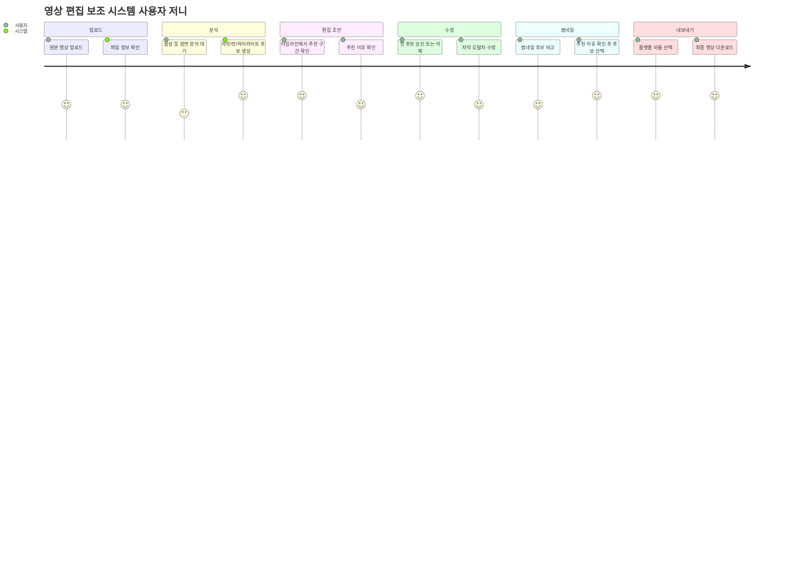

# 컷메이트 AI 기획서 초안

> **문서 버전:** v0.2 (Draft)  
> **작성일:** 2026. 05. 29  
> **목적:** 영상 편집 보조 시스템의 문제 정의, 핵심 기능, 사용자 흐름, MVP 범위, 썸네일 추천 기능을 구체화하기 위한 기획서

---

## 1. 프로젝트 개요

### 프로젝트명
- 가칭: 컷메이트 AI
- 대안 후보명: ClipPilot, EditMate

### 한 줄 정의
- 영상 원본 분석, 컷 편집 제안, 자막/하이라이트 생성, 썸네일 후보 추천을 통해 편집자의 반복 작업을 줄이고 콘텐츠 완성 속도를 높이는 AI 기반 영상 편집 보조 시스템

### 핵심 목표
- 영상 편집 과정에서 시간이 많이 드는 반복 작업을 자동화한다.
- 초보자도 일정 수준 이상의 편집 결과물을 빠르게 만들 수 있도록 돕는다.
- 편집자가 최종 의사결정을 유지하되, AI가 초안과 추천안을 제공하는 보조 도구로 설계한다.
- 영상 완성 후 업로드 준비에 필요한 썸네일 후보까지 함께 제안해 제작 흐름을 끊기지 않게 한다.
- 외부 유료 API 호출을 기본 전제로 두지 않고, 로컬에서 무료로 실행 가능한 오픈소스 모델과 영상 처리 도구를 우선 사용한다.

### 주요 사용자
- 숏폼/브이로그/강의/인터뷰 영상을 제작하는 1인 크리에이터
- 반복적인 컷 편집과 자막 작업이 많은 영상 편집자
- 영상 제작 경험은 적지만 빠르게 결과물을 만들고 싶은 마케터/교육 담당자

---

## 2. 문제 정의

### 2.1 사용자 문제
- 긴 원본 영상에서 불필요한 구간을 직접 찾아내는 데 시간이 오래 걸린다.
- 자막 생성, 오탈자 수정, 싱크 조정이 반복적이고 피로도가 높다.
- 하이라이트 장면을 선별하거나 숏폼으로 재가공하는 기준이 막연하다.
- 시청자가 클릭할 만한 썸네일 장면을 고르는 기준이 주관적이고 시간이 오래 걸린다.
- 편집 초보자는 컷 전환, 템포, 자막 스타일 등 기본 편집 판단이 어렵다.
- 편집 결과물을 플랫폼별 비율과 길이에 맞게 다시 조정해야 한다.

### 2.2 서비스 문제
- AI가 자동 편집을 하더라도 편집자의 의도를 반영하지 못하면 신뢰도가 낮아진다.
- 영상 분석 결과가 부정확하면 컷 추천, 자막, 하이라이트 품질이 함께 떨어진다.
- 썸네일 추천이 영상 내용과 다르거나 과도하게 자극적이면 콘텐츠 신뢰도를 해칠 수 있다.
- 고화질 영상 처리 비용과 처리 시간이 커질 수 있다.
- 저작권, 개인정보, 얼굴/음성 데이터 처리에 대한 안전장치가 필요하다.
- 유료 API 중심 구조는 장기 사용 시 비용 부담이 커지고, 개인 영상이 외부 서버로 전송되는 데 대한 거부감이 생길 수 있다.

---

## 3. 핵심 가치와 차별화

### 핵심 가치
- 반복 편집 작업 시간 절감
- 영상 내용 기반의 컷/하이라이트 추천
- 하이라이트 맥락 기반의 썸네일 후보 추천
- 자동 자막 생성 및 문장 정리
- 플랫폼별 결과물 변환 지원
- 편집자가 수정 가능한 AI 초안 제공

### 차별화 요소
- 단순 자동 편집이 아니라 "추천 근거"를 함께 제공한다.
- 컷 편집, 자막, 하이라이트, 숏폼 변환을 하나의 작업 흐름으로 연결한다.
- 하이라이트 구간과 썸네일 후보를 함께 제안해 "편집 완료"에서 "업로드 준비"까지의 간극을 줄인다.
- 원본 영상의 맥락을 분석해 콘텐츠 목적에 맞는 편집안을 제안한다.
- 편집자가 AI 제안을 승인/수정/거절할 수 있는 협업형 UX를 제공한다.
- 로컬 우선 아키텍처로 설계해 사용자가 비용, 모델, 프롬프트, 추천 기준을 직접 조정할 수 있게 한다.

---

## 4. MVP 범위

### 필수 기능 (Must Have)
1. 영상 업로드 및 기본 정보 추출
   - 영상 길이, 해상도, 음성 포함 여부, 프레임 비율 확인
   - 업로드 가능한 파일 형식과 용량 제한 정의

2. 음성 인식 기반 자동 자막 생성
   - 영상 음성을 텍스트로 변환
   - 타임코드 기반 자막 초안 생성
   - 사용자가 자막 문구와 싱크를 수정할 수 있도록 제공

3. 무음/반복/불필요 구간 탐지
   - 긴 침묵, 말 더듬음, 반복 발화, 의미 없는 대기 구간을 후보로 표시
   - 자동 삭제가 아니라 "삭제 추천 구간"으로 제안

4. 하이라이트 구간 추천
   - 발화 밀도, 키워드, 감정 변화, 장면 전환 등을 기준으로 주요 구간 후보 추천
   - 추천 이유를 함께 표시

5. 편집 타임라인 초안 제공
   - 추천 컷, 자막, 하이라이트 구간을 타임라인 형태로 시각화
   - 사용자가 구간을 승인/수정/삭제할 수 있도록 설계

6. 결과물 내보내기
   - 원본 비율 유지 버전
   - 숏폼용 9:16 비율 버전
   - 자막 포함/미포함 선택

7. 썸네일 후보 추천
   - 하이라이트 구간, 선명한 프레임, 인물 표정, 장면 대비를 기준으로 썸네일 후보 3~5개 추천
   - 각 후보에 "핵심 장면", "표정이 잘 보임", "제품 노출이 명확함" 등 추천 근거 표시
   - 사용자가 후보를 선택하거나 직접 프레임을 지정할 수 있도록 제공

### 후순위 기능 (Should/Could Have)
- BGM 자동 추천 및 볼륨 밸런싱
- 썸네일 텍스트 오버레이 문구 추천
- 브랜드 컬러/폰트 기반 썸네일 템플릿 적용
- 화자 분리 및 화자별 자막 스타일 적용
- 브랜드 템플릿/자막 스타일 프리셋
- 플랫폼별 제목/설명/해시태그 추천
- 다국어 번역 자막

### 제외 기능 (Won't Have)
- 완전 자동 게시 기능
- 실시간 라이브 편집
- 전문 색보정/사운드 믹싱 도구
- 딥페이크, 음성 복제, 얼굴 합성 기능
- 저작권이 불명확한 외부 음원 자동 삽입
- 영상에 없는 장면을 새로 생성하는 AI 썸네일 이미지 생성

### MVP 범위 원칙
- MVP의 썸네일 기능은 "영상 속 프레임 추천"에 집중한다.
- 텍스트 합성, 이미지 생성, A/B 테스트는 후순위로 두고, 먼저 후보 품질과 선택률을 검증한다.
- 모든 AI 추천은 자동 적용하지 않고 사용자의 확인과 선택을 거친다.
- MVP의 기본 분석은 로컬 실행을 기준으로 한다.
- 외부 API 연동은 필수 기능이 아니라 고품질 분석 옵션 또는 향후 확장 기능으로 둔다.

---

## 5. 사용자 페르소나

### 5.1 1인 크리에이터
> "촬영보다 편집이 더 오래 걸려요. 말이 빈 구간과 실수한 부분만 빨리 정리해줘도 훨씬 편할 것 같아요."

- **이름/나이:** 김하은 (28세)
- **콘텐츠 유형:** 브이로그, 제품 리뷰, 숏폼 클립
- **사용 환경:** MacBook, 스마트폰 촬영 영상
- **목표:** 긴 원본 영상을 빠르게 정리하고 숏폼 콘텐츠로 재가공
- **페인 포인트:** 컷 편집 피로, 자막 작업 반복, 업로드 주기 압박

### 5.2 교육 콘텐츠 제작자
> "강의 영상에서 핵심 설명 구간을 찾고, 자막까지 정리하는 시간이 너무 많이 듭니다."

- **이름/나이:** 박준호 (35세)
- **콘텐츠 유형:** 온라인 강의, 세미나, 튜토리얼
- **사용 환경:** 데스크톱 기반 긴 영상 편집
- **목표:** 강의 내용을 챕터별로 정리하고 학습용 자막 제공
- **페인 포인트:** 긴 영상 탐색, 챕터 분리, 전문 용어 자막 오인식

### 5.3 마케팅 콘텐츠 담당자
> "영상은 만들었는데 어떤 장면을 썸네일로 써야 클릭이 날지 늘 고민됩니다."

- **이름/나이:** 이서윤 (31세)
- **콘텐츠 유형:** 제품 소개, 고객 사례, 웨비나 요약, SNS 광고 소재
- **사용 환경:** 사내 노트북, 브랜드 가이드가 있는 협업 환경
- **목표:** 짧은 시간 안에 업로드 가능한 영상과 썸네일 후보를 함께 확보
- **페인 포인트:** 썸네일 선택 기준 부재, 브랜드 일관성 유지, 여러 플랫폼별 재가공 부담

---

## 6. 사용자 저니맵

| 단계 | 1. 영상 업로드 | 2. AI 분석 대기 | 3. 편집 초안 확인 | 4. 사용자 수정 | 5. 썸네일 선택 | 6. 결과물 내보내기 |
|---|---|---|---|---|---|---|
| 유저 행동 | 원본 영상 업로드 | 분석 진행률 확인 | 추천 컷/자막/하이라이트 확인 | 필요한 구간 승인/수정/삭제 | 썸네일 후보 비교 후 선택 | 포맷 선택 후 다운로드 |
| 유저 생각 | "파일만 올리면 초안이 나오면 좋겠다." | "얼마나 걸릴까?" | "왜 이 구간을 자르라고 했지?" | "내 의도에 맞게 조금만 바꾸면 되겠다." | "이 장면이면 사람들이 내용을 바로 이해하겠다." | "바로 업로드할 수 있겠다." |
| 감정 변화 | 기대 | 기다림/불안 | 흥미 | 통제감 | 확신 | 만족 |
| 터치 포인트 | 업로드 화면 | 분석 상태 화면 | 타임라인/자막 에디터 | 미리보기/수정 패널 | 썸네일 후보 패널 | Export 설정 |
| 시스템 과제 | 안정적 업로드 | 처리 시간 예측 | 추천 근거 제공 | 쉬운 편집 UX | 선명하고 맥락 있는 프레임 추천 | 플랫폼별 출력 |
| 잠재 위험 | 용량 초과 이탈 | 분석 시간 지연 | 추천 품질 불신 | 수정 UX 복잡 | 어색한 표정/흐린 프레임 추천 | 렌더링 실패 |
| 기획 대안 | 용량/형식 사전 안내 | 단계별 진행률 표시 | 근거 라벨 표시 | 원클릭 승인/되돌리기 | 후보별 추천 이유와 직접 프레임 선택 제공 | 실패 시 재시도 제공 |



---

## 7. 핵심 화면 구성

### 7.1 업로드 화면
- 영상 파일 업로드 영역
- 지원 파일 형식/최대 용량 안내
- 콘텐츠 목적 선택: 숏폼, 브이로그, 강의, 인터뷰, 홍보 영상
- 출력 목표 선택: 원본 요약, 하이라이트 추출, 자막 생성, 숏폼 변환

### 7.2 분석 진행 화면
- 업로드 완료 상태
- 음성 인식 진행률
- 장면/구간 분석 진행률
- 예상 완료 시간
- 실패 시 재시도 버튼

### 7.3 편집 초안 화면
- 영상 미리보기
- AI 추천 타임라인
- 삭제 추천 구간
- 하이라이트 추천 구간
- 자동 자막 패널
- 추천 근거 라벨
- 선택한 구간을 썸네일 후보로 보내는 액션

### 7.4 썸네일 추천 화면
- 썸네일 후보 3~5개 카드
- 후보별 추천 이유: 선명도, 표정, 제품/주제 노출, 하이라이트 연관성
- 플랫폼별 미리보기: YouTube 16:9, Shorts/Reels 9:16 커버, 1:1 피드
- 직접 프레임 선택 타임라인 스크러버
- 후보 선택/다운로드/내보내기 포함 여부 설정

### 7.5 내보내기 화면
- 비율 선택: 16:9, 9:16, 1:1
- 해상도 선택
- 자막 포함 여부
- 썸네일 포함 여부
- 파일 형식 선택
- 렌더링 상태 및 다운로드

---

## 8. 로컬 AI 및 영상 처리 설계 초안

### 8.0 로컬 우선 원칙
- 기본 MVP는 외부 유료 API 없이 로컬 머신 또는 사용자의 개인 서버에서 동작하는 것을 목표로 한다.
- 대형 범용 모델 하나에 모든 판단을 맡기지 않고, 작업별 오픈소스 도구와 경량 모델을 조합한다.
- 텍스트 자연어 설명은 로컬 LLM이 담당하되, 컷/썸네일 후보 선정은 영상/오디오 신호와 규칙 기반 점수를 함께 사용한다.
- API 기반 고품질 분석은 향후 옵션으로 둘 수 있지만, 기본 플로우가 API에 의존해서는 안 된다.

### 8.0.1 기본 로컬 처리 스택

| 영역 | 기본 도구/모델 | 역할 | MVP 적용 |
|---|---|---|---|
| 영상/오디오 추출 | FFmpeg | 원본 영상에서 오디오, 프레임, 프록시 영상 추출 | Must |
| 음성 인식 | faster-whisper | 로컬 자막 생성, 타임코드 추출 | Must |
| 무음/발화 구간 | Silero VAD 또는 오디오 레벨 분석 | 말하는 구간과 침묵 구간 분리 | Must |
| 장면 전환 | PySceneDetect, OpenCV | 장면 변화, 컷 포인트, 후보 프레임 추출 | Must |
| 썸네일 품질 분석 | OpenCV | 블러, 밝기, 얼굴/제품 구도, 크롭 안정성 점수화 | Must |
| 썸네일 의미 매칭 | OpenCLIP | 키워드/하이라이트와 프레임 의미 유사도 계산 | Should |
| 추천 이유 생성 | Qwen3-8B, gpt-oss-20b 등 로컬 LLM | 하이라이트/썸네일 추천 이유 문장화 | Should |
| 이미지 설명 보강 | Qwen3-VL-8B 등 로컬 VLM | 썸네일 후보의 시각적 설명 보강 | Could |
| 화자 분리 | pyannote.audio 또는 WhisperX | 인터뷰/강의 화자 구분 | Could |

### 8.1 분석 입력
- 영상 파일
- 오디오 트랙
- 프레임 샘플
- 사용자 선택 콘텐츠 목적
- 플랫폼 출력 목표
- 제목/주요 키워드(선택 입력)
- 브랜드 톤 또는 금지 표현(선택 입력)

### 8.2 AI 처리 단계
1. FFmpeg로 오디오 트랙, 저해상도 프록시, 프레임 샘플 추출
2. faster-whisper로 음성 인식 및 타임코드 생성
3. 문장 단위 자막 세그먼트 분리
4. Silero VAD 또는 오디오 레벨 분석으로 무음/발화 구간 탐지
5. 반복 발화, 말 더듬음, 의미 없는 대기 구간 후보 탐지
6. PySceneDetect/OpenCV로 장면 전환과 후보 프레임 추출
7. 자막 키워드, 발화 밀도, 장면 변화 기준으로 하이라이트 후보 점수화
8. OpenCV로 썸네일 후보의 선명도, 밝기, 구도, 크롭 안정성 점수화
9. OpenCLIP으로 하이라이트 키워드와 썸네일 후보의 의미 유사도 계산
10. 로컬 LLM으로 컷/하이라이트/썸네일 추천 근거 문장 생성
11. 편집 타임라인 초안 생성

### 8.3 출력 데이터 예시
```json
{
  "segments": [
    {
      "start": "00:01:12.300",
      "end": "00:01:28.900",
      "type": "highlight",
      "reason": "제품의 핵심 장점을 설명하는 구간",
      "subtitle": "이 기능은 반복 작업 시간을 줄여줍니다."
    }
  ],
  "cut_candidates": [
    {
      "start": "00:03:05.100",
      "end": "00:03:12.400",
      "reason": "긴 무음 구간"
    }
  ],
  "thumbnail_candidates": [
    {
      "timestamp": "00:01:18.200",
      "image_url": "https://cdn.example.com/projects/123/thumb_01.jpg",
      "internal_score": 0.87,
      "reason": "제품이 화면 중앙에 있고 핵심 설명 구간과 연결되는 선명한 프레임",
      "tags": ["product_visible", "highlight_related", "sharp_frame"]
    },
    {
      "timestamp": "00:02:41.600",
      "image_url": "https://cdn.example.com/projects/123/thumb_02.jpg",
      "internal_score": 0.81,
      "reason": "화자의 표정이 자연스럽고 감정 변화가 드러나는 장면",
      "tags": ["face_visible", "emotion", "clear_composition"]
    }
  ]
}
```

### 8.4 썸네일 추천 기준

| 기준 | 설명 | 가중치 예시 |
|---|---|---|
| 하이라이트 연관성 | 핵심 발화나 주요 장면과 연결되는 프레임인지 평가 | 높음 |
| 시각적 선명도 | 흔들림, 블러, 노이즈, 과도한 어두움을 제외 | 높음 |
| 주제 노출 | 제품, 인물, 화면 자료 등 콘텐츠 핵심 대상이 잘 보이는지 확인 | 높음 |
| 표정/감정 | 인터뷰, 브이로그, 리뷰 영상에서 자연스럽고 클릭 유도력이 있는 표정인지 평가 | 중간 |
| 구도 안정성 | 얼굴/제품이 잘리지 않고 플랫폼별 크롭에 견딜 수 있는지 확인 | 중간 |
| 안전성 | 민감 정보, 부적절한 장면, 왜곡 소지가 있는 프레임 제외 | 높음 |

---

## 9. 요구사항 초안

| 요구사항 ID | 기능명 | 상세 요구사항 | 우선순위 | 담당 |
| :--- | :--- | :--- | :--- | :--- |
| REQ-UP-001 | 영상 업로드 | 사용자는 지정된 형식의 영상 파일을 업로드할 수 있다. | Must | FE/BE |
| REQ-AI-001 | 음성 인식 | 업로드된 영상의 음성을 타임코드가 포함된 텍스트로 변환한다. | Must | AI/BE |
| REQ-AI-002 | 컷 후보 탐지 | 무음, 반복 발화, 불필요 구간을 삭제 추천 후보로 반환한다. | Must | AI |
| REQ-AI-003 | 하이라이트 추천 | 콘텐츠 목적에 맞는 핵심 구간 후보와 추천 근거를 반환한다. | Must | AI |
| REQ-AI-004 | 썸네일 후보 추천 | 하이라이트 연관성, 선명도, 구도, 안전성 기준으로 썸네일 후보와 추천 근거를 반환한다. | Must | AI |
| REQ-FE-001 | 타임라인 표시 | 추천 컷, 하이라이트, 자막을 타임라인 UI에 표시한다. | Must | FE |
| REQ-FE-002 | 사용자 승인/수정 | 사용자는 AI 추천 구간을 승인, 수정, 삭제할 수 있다. | Must | FE |
| REQ-FE-003 | 썸네일 후보 선택 | 사용자는 썸네일 후보를 비교하고 선택하거나 직접 프레임을 지정할 수 있다. | Must | FE |
| REQ-BE-001 | 분석 작업 관리 | 영상 분석 작업의 상태를 저장하고 진행률을 조회할 수 있다. | Must | BE |
| REQ-BE-002 | 결과물 렌더링 | 사용자가 선택한 설정에 따라 최종 영상 파일을 생성한다. | Must | BE |
| REQ-BE-003 | 썸네일 이미지 저장 | 선택된 썸네일 이미지를 프로젝트 산출물로 저장하고 다운로드 URL을 제공한다. | Must | BE |

---

## 10. 데이터 구조 초안

### 10.1 `User`
- `id`
- `email`
- `created_at`

### 10.2 `VideoProject`
- `id`
- `user_id`
- `title`
- `original_file_url`
- `duration`
- `resolution`
- `purpose`
- `status`
- `created_at`

### 10.3 `VideoSegment`
- `id`
- `project_id`
- `start_time`
- `end_time`
- `segment_type`
- `transcript`
- `recommendation_reason`
- `is_selected`

### 10.4 `Subtitle`
- `id`
- `project_id`
- `start_time`
- `end_time`
- `text`
- `edited_text`

### 10.5 `ExportJob`
- `id`
- `project_id`
- `format`
- `aspect_ratio`
- `include_subtitle`
- `include_thumbnail`
- `status`
- `output_file_url`
- `thumbnail_file_url`
- `created_at`

### 10.6 `ThumbnailCandidate`
- `id`
- `project_id`
- `timestamp`
- `image_url`
- `internal_score`
- `reason`
- `tags`
- `is_selected`
- `created_at`

---

## 11. 품질 기준 및 성공 지표

### 품질 기준
- 자동 자막의 기본 인식 정확도가 사용자가 수정 가능한 수준이어야 한다.
- 컷 추천은 자동 삭제가 아니라 후보 제안 방식으로 제공한다.
- 하이라이트 추천에는 사용자가 납득할 수 있는 근거가 포함되어야 한다.
- 썸네일 후보는 흐린 프레임, 눈 감은 표정, 과도하게 잘린 구도, 민감 정보 노출 장면을 기본 제외해야 한다.
- 썸네일 추천에는 사용자가 납득할 수 있는 장면 선택 이유가 포함되어야 한다.
- 분석 실패 시 원인을 안내하고 재시도할 수 있어야 한다.

### 성공 지표
- 첫 편집 초안 생성 완료율
- AI 추천 구간 승인률
- 썸네일 후보 선택률
- 썸네일 직접 프레임 재선택률
- 자막 수정 후 사용률
- 업로드부터 첫 결과물 다운로드까지 걸린 시간
- 사용자가 체감한 편집 시간 절감률
- 동일 사용자의 재사용률

### MVP 검증 기준
- 20분 이하 영상 기준, 업로드 후 첫 편집 초안과 썸네일 후보가 함께 생성되어야 한다.
- 평균 사용 영상은 5~10분으로 예상하고, 이 구간에서 분석 대기 피로를 최소화한다.
- 썸네일 후보 3개 이상 중 1개 이상은 사용자가 즉시 선택 가능한 품질이어야 한다.
- 추천 구간과 썸네일 후보의 추천 근거가 서로 충돌하지 않아야 한다.
- 사용자는 AI 추천을 적용하지 않고도 직접 수정하거나 건너뛸 수 있어야 한다.

---

## 12. 리스크 및 대응 방안

| 리스크 | 설명 | 대응 방안 |
|---|---|---|
| 분석 시간 지연 | 긴 영상 또는 고화질 영상 처리 시간이 길어질 수 있음 | 영상 길이 제한, 진행률 표시, 백그라운드 작업 처리 |
| 자막 품질 저하 | 소음, 발음, 전문 용어로 인식 오류 발생 | 사용자 사전, 편집 가능한 자막 UI, 원문 재생 버튼 |
| 추천 결과 불신 | AI가 왜 해당 구간을 추천했는지 알기 어려움 | 추천 근거 라벨과 미리보기 제공 |
| 썸네일 품질 저하 | 흐린 프레임, 어색한 표정, 핵심 주제가 없는 장면이 추천될 수 있음 | 선명도/얼굴/구도 필터링, 직접 프레임 선택 기능 제공 |
| 썸네일 과장 표현 | 영상 내용과 맞지 않는 자극적인 후보가 선택될 수 있음 | 영상 내 실제 프레임만 사용, 추천 근거와 안전성 필터 적용 |
| 렌더링 비용 증가 | 영상 처리 인프라 비용이 높아질 수 있음 | MVP 용량 제한, 비동기 큐, 저해상도 프록시 활용 |
| 개인정보 이슈 | 얼굴, 음성, 민감 정보가 포함될 수 있음 | 보관 기간 안내, 삭제 기능, 접근 권한 제한 |
| 로컬 처리 성능 편차 | 사용자 장비 사양에 따라 분석 시간이 크게 달라질 수 있음 | 저해상도 프록시 사용, 모델 크기 선택 옵션, 백그라운드 처리 |
| 로컬 모델 설치 부담 | 모델 다운로드 용량과 설치 과정이 진입 장벽이 될 수 있음 | 기본 모델 프리셋, 설치 상태 점검, 경량/고품질 모드 분리 |

---

## 13. 향후 확장 방향

- 팀 협업 기반 리뷰/코멘트 기능
- 브랜드별 자막/인트로/아웃트로 템플릿
- YouTube Shorts, TikTok, Instagram Reels별 최적화 추천
- 영상 성과 데이터 기반 다음 편집 추천
- 편집 스타일 학습 및 개인화 프리셋
- 제목/설명/해시태그/썸네일을 묶은 업로드 패키지 추천
- 썸네일 A/B 테스트 결과 기반 추천 로직 개선
- 외부 API 기반 고품질 분석 모드 선택 제공
- 사용자 장비 사양에 맞춘 모델 자동 선택

---

## 14. MVP 상세 시나리오

### 14.1 대표 사용 시나리오
1. 사용자가 평균 5~10분, 최대 20분 이하의 인터뷰 또는 리뷰 영상을 업로드한다.
2. 콘텐츠 목적을 "숏폼 변환" 또는 "하이라이트 추출"로 선택한다.
3. 시스템은 자막, 삭제 추천 구간, 하이라이트 후보, 썸네일 후보를 생성한다.
4. 사용자는 타임라인에서 삭제 추천 구간을 승인하고 자막 일부를 수정한다.
5. 사용자는 썸네일 후보 3~5개 중 하나를 선택하거나 직접 프레임을 지정한다.
6. 사용자는 9:16 숏폼 영상과 썸네일 이미지를 함께 다운로드한다.

### 14.2 콘텐츠 유형별 추천 전략

| 콘텐츠 유형 | 컷/하이라이트 기준 | 썸네일 추천 기준 |
|---|---|---|
| 브이로그 | 감정 변화, 장소 전환, 대화 밀도 | 인물 표정, 배경 분위기, 장면 다양성 |
| 제품 리뷰 | 제품 언급 구간, 장단점 비교, 결론 발화 | 제품이 중앙에 보이는 장면, 사용 장면, 전후 비교 장면 |
| 강의/튜토리얼 | 핵심 개념 설명, 단계 전환, 예제 풀이 | 자료 화면이 선명한 장면, 핵심 키워드가 보이는 장면 |
| 인터뷰 | 인사이트 발화, 질문 전환, 감정 변화 | 화자 표정, 안정적인 구도, 핵심 발화와 연결된 장면 |
| 홍보 영상 | 브랜드/혜택 언급, CTA 구간, 제품 노출 | 브랜드/제품 노출, 밝고 선명한 구도, 메시지 전달력 |

### 14.3 MVP 출시 단계
- **1차:** 업로드, 음성 인식, 자막 초안, 무음/반복 구간 탐지
- **2차:** 하이라이트 추천, 추천 근거 라벨, 타임라인 승인/수정 UX
- **3차:** 썸네일 후보 추천, 직접 프레임 선택, 썸네일 이미지 다운로드
- **4차:** 플랫폼별 내보내기, 렌더링 안정화, 사용 지표 수집

---

## 15. 오픈 질문

- MVP에서 지원할 최대 파일 용량은 어디까지로 제한할 것인가?
- 20분 초과 영상에 대해 분할/핵심 구간 추출 가이드를 어느 정도 상세하게 제공할 것인가?
- AI 편집 추천의 기준을 콘텐츠 유형별로 다르게 둘 것인가?
- 자막 정확도보다 컷 추천 품질을 우선할 것인가, 반대로 둘 것인가?
- 사용자가 기대하는 결과물은 "완성본"인가, "편집 초안"인가?
- 로컬 처리 시간이 길어질 때 경량/기본/고품질 모드를 어떤 기준으로 추천할 것인가?
- 썸네일 텍스트 오버레이는 어느 출시 단계에서 포함할 것인가?
- 플랫폼별 썸네일 크롭 기준을 어디까지 지원할 것인가?
- 기본 로컬 모델을 어느 크기까지 번들/자동 다운로드 대상으로 둘 것인가?
- CPU-only 환경을 MVP 지원 범위에 포함할 것인가, GPU/Apple Silicon 권장으로 안내할 것인가?
